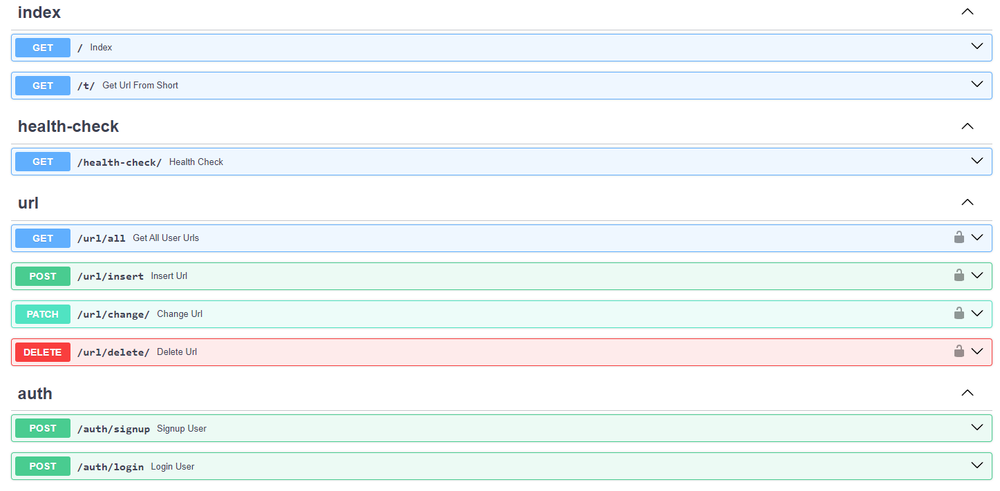

# Link Shortener Service

This project is a link-shortening service featuring a Single Page Application (SPA) built with vanilla JavaScript for the frontend and FastAPI for the backend. Project management is streamlined using a Makefile and the `make` utility.

- [Russian Documentation](./assets/README_RUS.md)
- [main page](./assets/main_page.png)
- [login page](./assets/login_page.png)

## Project Overview

The Link Shortener Service is designed to provide users with an easy way to shorten long URLs. The application is structured as a SPA with FastAPI handling the backend functionalities. The project setup and management are facilitated through a Makefile, simplifying the environment setup, starting, and stopping processes.

### Project Routes

Below is a visual representation of the project's routes:

### Local Installation

To set up the project locally, follow these steps:

1. **Environment Configuration:**

   - Create env.dev by following the example in .env.dev.dist.
   - Similarly, create env.test.local by following the example in .env.test.local.dist.

2. **Set Up the Virtual Environment:**
   - Run python -m venv env to create a virtual environment.
   - Activate the environment:
     - On Linux: `source ./env/bin/activate`
     - On Windows: `./env/Scripts/activate`
   - It is recommended to run the setup on Linux as the startup scripts are implemented as bash scripts.

3. **Starting the Development Environment:**
   - Use `make dev-start` to start the development environment.
   - After finishing your work, clean up by running `make dev-stop`.

4. **Starting the Application:**
   - Execute `sh ./scripts/start.sh` to run the application.

### Deployment in Docker Containers (Production)

To deploy the application in production using Docker containers, follow these steps:

1. **Environment Configuration:**
   - Create env.prod by following the example in .env.prod.dist.
   - Similarly, create env.test.prod by following the example in .env.test.prod.dist.

2. **Starting and Stopping Containers:**
   - Start the production containers with `make prod-start`.
   - After the work is complete, clean up the environment with `make prod-stop`.
