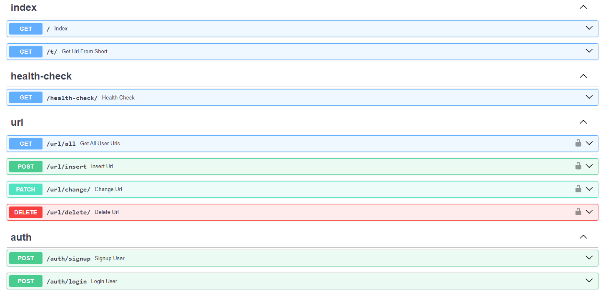

Вот отредактированный русский вариант README файла с учетом стиля Markdown:

# Сервис Сокращения Ссылок

Данный проект представляет собой сервис сокращения ссылок с SPA приложением, реализованным на чистом JavaScript, и бекендом на FastAPI. Для управления проектом используется Makefile и утилита `make`.

- [главная страница](./main_page.png)
- [страница входа](./login_page.png)

## Описание Проекта

Сервис Сокращения Ссылок предназначен для простого и удобного сокращения длинных URL. Приложение представляет собой SPA с FastAPI на стороне бекенда. Управление проектом и настройка окружения выполняются с помощью Makefile, что упрощает процесс запуска, остановки и очистки окружения.

### Роуты Проекта

Ниже представлена визуализация роутов проекта:

### Локальная Установка

Для локальной установки проекта выполните следующие шаги:

1. **Настройка окружения:**
   - Создайте `env.dev` по примеру `.dist.env.dev`.
   - Также создайте `env.test.local` по примеру `.dist.env.test.local`.

2. **Создание виртуального окружения:**
   - Выполните команду `python -m venv env` для создания виртуального окружения.
   - Активируйте окружение:
     - На Linux: `source ./env/bin/activate`
     - На Windows: `./env/Scripts/activate`
   - Рекомендуется использовать Linux, так как запуск реализован через bash скрипты.

3. **Запуск окружения для разработки:**
   - Используйте `make dev-start` для запуска окружения разработки.
   - По завершении работы выполните `make dev-stop` для очистки окружения.

4. **Запуск приложения:**
   - Выполните `sh ./scripts/start.sh` для запуска приложения.

### Установка в Докер Контейнерах (Продакшн)

Для установки в продакшн в Docker контейнерах выполните следующие шаги:

1. **Настройка окружения:**
   - Создайте `env.prod` по примеру `.dist.env.prod`.
   - Также создайте `env.test.prod` по примеру `dist.env.test.prod`.

2. **Запуск и остановка контейнеров:**
   - Запустите продакшн контейнеры с помощью `make prod-start`.
   - По окончании работы выполните `make prod-stop` для очистки окружения.
